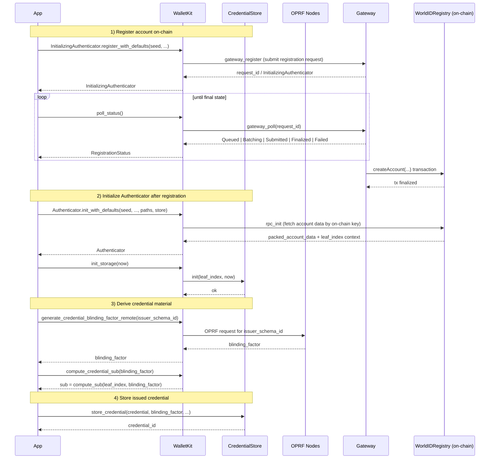

WalletKit enables mobile applications to use [World ID](https://world.org/world-id).

Part of the [World ID SDK](https://docs.world.org/world-id).

WalletKit can be used as a Rust crate, or directly as a Swift or Android package. WalletKit includes foreign bindings for direct usage in Swift/Kotlin through [UniFFI](https://github.com/mozilla/uniffi-rs).

## Installation

**To use WalletKit in another Rust project:**

```bash
cargo install walletkit
```

**To use WalletKit in an iOS app:**

WalletKit is distributed through a separate repo specifically for Swift bindings. This repo contains all the binaries required and is a mirror of `@worldcoin/walletkit`.

1. Navigate to File > Swift Packages > Add Package Dependency in Xcode.
2. Enter the WalletKit repo URL (note this is **not** the same repo): `https://github.com/worldcoin/walletkit-swift`

**To use WalletKit in an Android app:**

WalletKit's bindings for Kotlin are distributed through GitHub packages.

1. Update `build.gradle` (App Level)

```kotlin
dependencies {
    /// ...
    implementation "org.world:walletkit:VERSION"
}
```

Replace `VERSION` with the desired WalletKit version.

2. Sync Gradle.

## Local development (Android/Kotlin)

### Prerequisites

1. **Docker Desktop**: Required for cross-compilation
   - The build uses [`cross`](https://github.com/cross-rs/cross) which runs builds in Docker containers with all necessary toolchains
   - Install via Homebrew:
     ```bash
     brew install --cask docker
     ```
   - Launch Docker Desktop and ensure it's running before building

2. **Android SDK + NDK**: Required for Gradle Android tasks
   - Install via Android Studio > Settings > Android SDK (ensure the NDK is installed)
   - Set `sdk.dir` (and `ndk.dir` if needed) in `kotlin/local.properties`

### Building and publishing

To test local changes before publishing a release, use the build script to compile the Rust library, generate UniFFI bindings, and publish a SNAPSHOT to Maven Local:

```bash
./kotlin/build_android_local.sh 0.3.1
```

Example with custom Rust locations:
```bash
RUSTUP_HOME=~/.rustup CARGO_HOME=~/.cargo ./kotlin/build_android_local.sh 0.1.0-SNAPSHOT
```

> **Note**: The script can be run from any working directory (it resolves its own location). It sets `RUSTUP_HOME` and `CARGO_HOME` to `/tmp` by default to avoid Docker permission issues when using `cross`. You can override them by exporting your own values.

This will:
1. Build the Rust library for all Android architectures (arm64-v8a, armeabi-v7a, x86_64, x86)
2. Generate Kotlin UniFFI bindings
3. Publish to `~/.m2/repository/org/world/walletkit/`

In your consuming project, ensure `mavenLocal()` is included in your repositories and update your dependency version to the SNAPSHOT version (e.g., `0.3.1`).

## Development

### Linting

WalletKit uses feature flags (e.g. `semaphore`, `storage`) that gate code paths with `#[cfg]`. To catch warnings across all configurations, run clippy three ways:

```bash
cargo clippy --workspace --all-targets --all-features -- -D warnings
cargo clippy --workspace --all-targets -- -D warnings
cargo clippy --workspace --all-targets --no-default-features -- -D warnings
```

CI runs all three checks. Formatting:

```bash
cargo fmt -- --check
```

## Overview

WalletKit is broken down into separate crates, offering the following functionality.

- `walletkit-core` - Enables basic usage of a World ID to generate ZKPs using different credentials.

### World ID Secret

- Each World ID requires a secret. The secret is used in ZKPs to prove ownership over a World ID.
- Each host app is responsible for generating, storing and backing up a World ID secret.
- A World ID secret is a 32-byte secret generated with a cryptographically secure random function.
- The World ID secret **must** never be exposed to third-parties and **must not** leave the holder's device.
  //TODO: Additional guidelines for secret generation and storage.

## Getting Started

WalletKit is generally centered around a World ID. The most basic usage requires initializing a `WorldId`.

A World ID can then be used to generate [Zero-Knowledge Proofs](https://docs.world.org/world-id/further-reading/zero-knowledge-proofs).

A ZKP is analogous to _presenting_ a credential.

```rust
use walletkit::{proof::ProofContext, CredentialType, Environment, world_id::WorldId};

async fn example() {
    let world_id = WorldId::new(b"not_a_real_secret", &Environment::Staging);
    let context = ProofContext::new("app_ce4cb73cb75fc3b73b71ffb4de178410", Some("my_action".to_string()), None, CredentialType::Orb);
    let proof = world_id.generate_proof(&context).await.unwrap();

    println!(proof.to_json()); // the JSON output can be passed to the Developer Portal, World ID contracts, etc. for verification
}
```

## 🛠️ Logging

WalletKit uses `tracing` internally for all first-party logging and instrumentation.
To integrate with iOS/Android logging systems, initialize WalletKit logging with a
foreign `Logger` bridge.

`Logger` is intentionally minimal and level-aware:

- `log(level, message)` receives all log messages.
- `level` is one of: `Trace`, `Debug`, `Info`, `Warn`, `Error`.

This preserves severity semantics for native apps while still allowing
forwarding to Datadog, Crashlytics, `os_log`, Android `Log`, or any custom sink.

### Basic Usage

Implement the `Logger` trait and initialize logging once at app startup:

```rust
use walletkit_core::logger::{init_logging, LogLevel, Logger};
use std::sync::Arc;

struct MyLogger;

impl Logger for MyLogger {
    fn log(&self, level: LogLevel, message: String) {
        println!("[{level:?}] {message}");
    }
}

init_logging(Arc::new(MyLogger), Some(LogLevel::Debug));
```

### Swift Integration

```swift
class WalletKitLoggerBridge: WalletKit.Logger {
    static let shared = WalletKitLoggerBridge()

    func log(level: WalletKit.LogLevel, message: String) {
        switch level {
        case .trace, .debug:
            Log.debug(message)
        case .info:
            Log.info(message)
        case .warn:
            Log.warn(message)
        case .error:
            Log.error(message)
        @unknown default:
            Log.error(message)
        }
    }
}

public func setupWalletKitLogging() {
    WalletKit.initLogging(logger: WalletKitLoggerBridge.shared, level: .debug)
}
```

### Kotlin Integration

```kotlin
class WalletKitLoggerBridge : WalletKit.Logger {
    companion object {
        val shared = WalletKitLoggerBridge()
    }

    override fun log(level: WalletKit.LogLevel, message: String) {
        when (level) {
            WalletKit.LogLevel.TRACE, WalletKit.LogLevel.DEBUG ->
                Log.d("WalletKit", message)
            WalletKit.LogLevel.INFO ->
                Log.i("WalletKit", message)
            WalletKit.LogLevel.WARN ->
                Log.w("WalletKit", message)
            WalletKit.LogLevel.ERROR ->
                Log.e("WalletKit", message)
        }
    }
}

fun setupWalletKitLogging() {
    WalletKit.initLogging(WalletKitLoggerBridge.shared, WalletKit.LogLevel.DEBUG)
}
```

## Authenticator, Blinding Factor, Sub, and On-chain Registration



How it works in code:
- **On-chain registration** uses `InitializingAuthenticator::register_with_defaults` / `register` and then `poll_status` until `Finalized`.
- **Authenticator creation** happens with `Authenticator::init_with_defaults` / `init` after the account exists on-chain; then `init_storage(now)` binds local storage to the authenticator leaf.
- **Blinding factor generation** is remote (`generate_credential_blinding_factor_remote`) and calls OPRF nodes.
- **`sub` creation** is local (`compute_credential_sub`) and is derived from the authenticator's internal `leaf_index` plus the provided `blinding_factor`.
- **Credential persistence** stores both the issued credential and its blinding factor in `CredentialStore` (`store_credential`), so later proof generation can use them.
