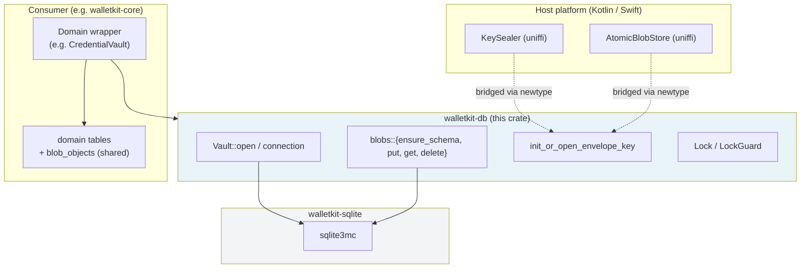

# walletkit-db

Encrypted on-device storage abstractions for WalletKit: vault opener,
content-addressed blobs, sealed key envelope, and cross-process lock. Built on
`walletkit-sqlite`; plain Rust with no `uniffi`.

Consumed by `walletkit-core::storage` (credential vault) and by sibling SDKs in the WalletKit workspace that need an encrypted on-device store.

## Concepts

Five physical pieces. Knowing what each one is and isn't makes everything else straightforward.

- **Vault** — the encrypted SQLite file on disk (e.g. `account.vault.sqlite`). Opened by `Vault::open`; accessed via `Vault::connection() -> &Connection`. SQLite's WAL-mode file locks serialize cross-process writers; walletkit-db doesn't layer another lock on top.
- **Envelope** — a small CBOR file (e.g. `account_keys.bin`) holding the sealed 32-byte `K_intermediate`. The seal is done by the host's `KeySealer`. Managed by `init_or_open_envelope_key` + `KeyEnvelope`.
- **Lock** — a separate empty file used as a cross-process mutex via `flock` / `LockFileEx`. Acquired internally by `init_or_open_envelope_key` (envelope-init bootstrap race) and by consumers around operations that mix SQL with filesystem state (e.g. plaintext export/import).
- **`blob_objects` table** — one shared table inside the vault for content-addressed bytes, keyed by SHA-256. Consumer-specific tables reference rows here by `content_id`. Managed by `blobs::*`.
- **`KeySealer` + `AtomicBlobStore`** — two async traits the host implements. `KeySealer` seals/unseals bytes using platform key protection; `AtomicBlobStore` reads/writes the envelope file. walletkit-db never touches the OS keystore or the filesystem directly.

## Architecture


```mermaid
flowchart TB
    subgraph Host["Host platform (Kotlin / Swift)"]
        KS["KeySealer (uniffi)"]
        BS["AtomicBlobStore (uniffi)"]
    end
    subgraph WKDB["walletkit-db (this crate)"]
        OV["Vault::open / connection"]
        Blobs["blobs::{ensure_schema, put, get, delete}"]
        Env["init_or_open_envelope_key"]
        Lock["Lock / LockGuard"]
    end
    subgraph WKSQL["walletkit-sqlite"]
        Cipher["sqlite3mc"]
    end
    subgraph Consumer["Consumer (e.g. walletkit-core)"]
        Wrapper["Domain wrapper<br/>(e.g. CredentialVault)"]
        Tables["domain tables<br/>+ blob_objects (shared)"]
        Wrapper --> Tables
    end
    KS -.bridged via newtype.-> Env
    BS -.bridged via newtype.-> Env
    Wrapper --> WKDB
    OV --> Cipher
    Blobs --> Cipher
    style WKDB fill:#e8f4f8
    style WKSQL fill:#f3f4f6
```

Dependency direction is one-way: consumers depend on `walletkit-db`, which
depends on `walletkit-sqlite`. `walletkit-db` doesn't know about its consumers,
`uniffi`, or any specific consumer schema. Each consumer brings its own
filename, sealing context, lock file, vault file, and SQL schema.

## Key hierarchy

- **Sealing key** — root key material controlled by the host's `KeySealer`. Native adapters can use a non-extractable hardware key; browser adapters can derive it from a passkey PRF. walletkit-db only relies on the behavioral contract of the sealer.
- **`K_intermediate`** — 32-byte random key per consumer-vault. Generated once via `getrandom`, sealed by the `KeySealer`, persisted as a CBOR `KeyEnvelope`, and used as the SQLite page-encryption key by sqlite3mc.
- **Sealing context** — non-secret label bound to the sealed value (e.g. `worldid:account-key-envelope`). An adapter may use AEAD additional authenticated data, context-specific key selection, or an equivalent mechanism. Per-consumer contexts prevent envelope substitution.

## Startup

**Cold start:** open `Lock` → `init_or_open_envelope_key` generates fresh `K_intermediate`, seals it via `KeySealer`, writes the envelope via `AtomicBlobStore`. `Vault::open` opens the SQLite file via `sqlite3mc`, runs the consumer's schema callback, runs `PRAGMA integrity_check`.

**Warm start:** same flow, but the envelope already exists. `init_or_open_envelope_key` reads and unseals it to recover the bit-for-bit original `K_intermediate`. Schema callback is idempotent (`CREATE TABLE IF NOT EXISTS`).

**Loss of the sealing capability:** the envelope on disk becomes unsealable. Recovery requires a separate backup path that re-wraps the data under independently recoverable key material.

## Encryption

`K_intermediate` is hex-encoded and passed to sqlite3mc as a raw key via `PRAGMA key = "x'<hex>'"` (bypasses any passphrase KDF). sqlite3mc then encrypts each page with ChaCha20-Poly1305 AEAD and tamper-checks via the Poly1305 MAC. Wrong key → `SQLITE_NOTADB` on first page read. Bit-flip on disk → `SQLITE_CORRUPT`. WAL mode for concurrent readers.

## Threat model

All rows assume the host's `KeySealer` protects its key material from an offline disk-copy attacker. An implementation that stores the sealing key alongside the envelope voids the "Safe" rows below.

| Tier | Status | What protects you |
|---|---|---|
| Disk copy / lost device / backup extraction | **Safe** | Vault + envelope are encrypted, and the sealing key is unavailable to the disk-copy attacker. |
| Code running inside the app session | **Exposed** | Attacker calls the legitimate sealer as the app and unseals envelopes. Defense lives in host access policy. |
| File corruption / envelope swap | **Safe** | Per-page MAC fails; the sealing-context binding rejects substituted envelopes. |
| Key-sealing mechanism compromise | Out of scope | — |

**Defense-in-depth lever:** host policy on the sealing operation, such as iOS `kSecAccessControlBiometryCurrentSet`, Android `setUserAuthenticationRequired(true)`, or passkey user verification. walletkit-db is neutral; the policy lives in the host adapter.

## Per-consumer isolation

If multiple consumers share the device (today the credential vault; later an OrbKit PCP store, etc.), the host has to give each one its own secrets and its own files:

1. Separate sealing key material or a context-aware sealer.
2. A separate sealing context passed to `init_or_open_envelope_key`.
3. A separate envelope filename, vault file, and lock file.

walletkit-db requires the sealer to bind operations to context: an envelope sealed under one context won't open under another. Everything else is host wiring. Reusing both sealing key material and context across consumers breaks the isolation.

## Usage

A consumer wires up storage in four steps:

```rust
use walletkit_db::{blobs, init_or_open_envelope_key, Lock, Vault};

// 1. Cross-process lock. One file per consumer.
let lock = Lock::open(&paths.lock_path())?;

// 2. Unseal or generate the consumer's intermediate key.
//    Filename + context are per-consumer so different vaults never share keys.
let k_intermediate = init_or_open_envelope_key(
    &my_key_sealer_adapter,
    &my_blob_store_adapter,
    &lock,
    "my_consumer_keys.bin",
    b"my-consumer:key-envelope",
    now,
).await?;

// 3. Open the encrypted SQLite database with the consumer's own schema.
let vault = Vault::open(&paths.db_path(), &k_intermediate, |conn| {
    blobs::ensure_schema(conn)?;
    my_schema::ensure_schema(conn)
})?;

// 4. Store / read / delete.
let conn = vault.connection();
let cid = blobs::put(conn, MY_KIND_TAG, &payload_bytes, now)?;
let bytes = blobs::get(conn, &cid)?.expect("present");
blobs::delete(conn, &cid)?;
```

The consumer brings a `KeySealer` impl, an `AtomicBlobStore` impl, a `kind: u8` tag space, and its own SQL schema. The crate handles cipher setup, schema dispatch, integrity check, content hashing (`SHA-256("worldid:blob" || [kind] || plaintext)`), CBOR envelope persistence, and the lock.

## Public surface

- `Vault::open(path, key, ensure_schema) -> StoreResult<Vault>`, `Vault::connection(&self) -> &Connection`.
- `blobs::{ensure_schema, put, get, delete, compute_content_id}` plus `pub type ContentId = [u8; 32]`.
- `init_or_open_envelope_key(...) -> Future<Output = StoreResult<SecretBox<[u8; 32]>>>`.
- `Lock` / `LockGuard` — native `flock` / `LockFileEx`, no-op on WASM.
- `KeySealer` / `AtomicBlobStore` traits — async, plain Rust.
- `StoreError` / `StoreResult`.

Low-level `Connection`, `Transaction`, `Statement`, `Row`, `StepResult`,
`Value`, `cipher::*`, `Error`, and `DbResult` belong to `walletkit-sqlite`.

## On-disk format

Schemas, CBOR envelope layout, content_id derivation, and the `account_keys.bin` / `worldid:account-key-envelope` filename + context tags are byte-stable. Existing user databases keep working without migration. Frozen-byte tests live next to the code they cover (`blobs.rs`, `envelope.rs`).

## Platforms

Native (macOS, Linux, Windows): static `sqlite3mc` from the build script. `wasm32-unknown-unknown`: `sqlite-wasm-rs` with the `sqlite3mc` feature; `Lock` collapses to a no-op.
