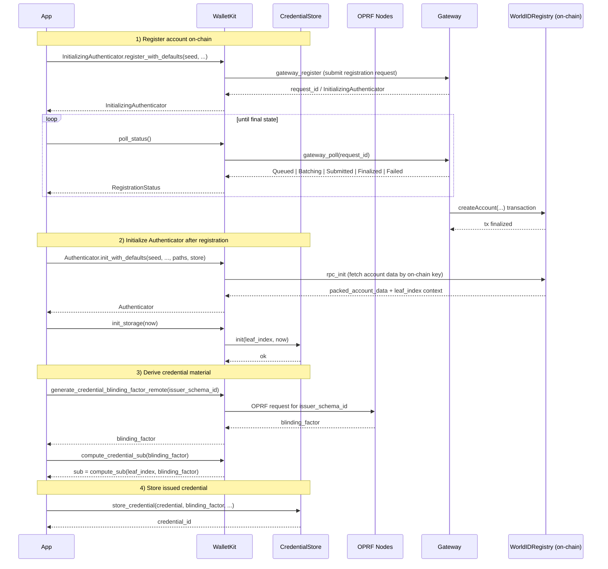

# Accounts and credentials

This page explains how a WalletKit app registers a World ID account, opens it, and
stores credentials for later proofs. Method names on this page are the Rust names;
the Swift, Kotlin, and browser APIs use the same names in their own casing.

## The authenticator seed

An account's authenticator keys derive from a 32-byte seed. The host app is
responsible for the seed:

- Generate it with a cryptographically secure random number generator.
- Store it securely and back it up. WalletKit doesn't persist the seed.
- Never expose it to third parties.

## The credential store

`CredentialStore` keeps the account's credentials in an encrypted SQLite vault.
On iOS and Android, the app creates it from platform components that hold the
database key in the device keystore; for the types involved, see the
[`storage` module on docs.rs](https://docs.rs/walletkit-core/latest/walletkit_core/storage/index.html).
In the browser, the app supplies the key itself; see
[Protect the database key](web/package.md#protect-the-database-key).

## From registration to stored credential

The following diagram shows the calls between the app, WalletKit, and the World ID
services, from registration to a stored credential.

The steps in the diagram work as follows:

1. **Registration.** `InitializingAuthenticator::register_with_defaults` (or
   `register`) submits the account to the gateway. The app calls `poll_status`
   until the status is `Finalized` or `Failed`. A `Failed` status carries the
   gateway's `error` and, when available, an `error_code`.
1. **Authenticator creation.** After the account exists on-chain,
   `Authenticator::init_with_defaults` (or `init`) opens it. `init_storage(now)`
   then binds local storage to the account's leaf index.
1. **Blinding factor.** `generate_credential_blinding_factor_remote` asks the OPRF
   nodes for the blinding factor of an issuer schema.
1. **Credential subject.** `compute_credential_sub` derives the credential's `sub`
   locally from the account's leaf index and the blinding factor.
1. **Storage.** `store_credential` saves the issued credential with its blinding
   factor in the `CredentialStore`, so that later proofs can use both.
