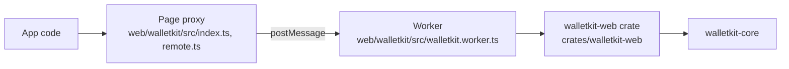

# How the browser package works

This page explains how `@worldcoin/walletkit-web` runs WalletKit in a browser. It
is for contributors to the package. To use the package, see
[Use WalletKit in the browser](package.md).

## Components

The package has four layers. Each layer talks only to the one next to it.

In order from the app down:

1. **Page proxy.** `initializeWalletKit` starts the worker and returns a typed
   proxy. The proxy turns every property access into a request to the worker and
   returns a `Promise`. Method signatures come from the declarations that
   `wasm-bindgen` generates. Only the public type names are listed by hand, in
   `remote.ts` and `index.ts`.
1. **Worker.** The worker loads the WASM module, installs persistent storage, and
   runs requests. It keeps every Rust object and gives the page an opaque handle
   for each one.
1. **`walletkit-web` crate.** A `wasm-bindgen` facade over `walletkit-core`, with
   one wrapper class for each UniFFI object that the browser supports. Wrappers
   keep the names and arguments of the Swift and Kotlin bindings, in `camelCase`.
1. **`walletkit-core`.** The same Rust code that the Swift and Kotlin bindings use,
   built for `wasm32-unknown-unknown`.

The browser package doesn't use UniFFI. The facade exports only the surface that a
browser can serve: it has no foreign traits or callbacks.

## Requests and objects

[`protocol.ts`](https://github.com/worldcoin/walletkit/blob/main/web/walletkit/src/protocol.ts) defines the messages between
the page and the worker. A call names its target in one of three ways: a
module-level function, a static function of a class, or a method of an object
handle.

Rust objects can't cross `postMessage`, so the worker keeps them in a handle table.
When a call returns a Rust object, the worker stores it and returns `{ $ref:
handle }`, and the page wraps the handle in a proxy. When the page passes a proxy
as an argument, the page sends its handle, and the worker swaps it back for the
object. Every other value crosses as structured-clone data.

An object stays in the worker until one of the following happens:

- The app calls `free()` on the proxy.
- The proxy is garbage collected. A `FinalizationRegistry` then releases it.
- The app closes the instance. `close()` frees every remaining object.

A proxy belongs to the instance that created it. A call that passes it to another
instance rejects with a `TypeError`, because its handle could name an unrelated
object there.

The worker dispatches only functions and methods that the WASM module exports. It
rejects `wasm-bindgen` internals, names that start with `_`, and the module setup
functions that only the worker calls. As a result, an export added to the
`walletkit-web` crate is callable from the page with no change to the worker.

## Ordering

The worker runs one request at a time, including the awaited part of asynchronous
calls. Rust state shared between objects, such as a credential store that an
authenticator also uses, therefore never sees interleaved operations.

The cost is head-of-line blocking: a call that never settles blocks every call
queued behind it. `close()` sends its request through the same queue and, after
`CLOSE_TIMEOUT_MS` in [`index.ts`](https://github.com/worldcoin/walletkit/blob/main/web/walletkit/src/index.ts), terminates the
worker.

## Byte arrays and secrets

Seeds and database keys cross the worker boundary as `Uint8Array`s. The page copies
each array and transfers the copy's buffer, so the page heap keeps no second copy.
The caller's own array is left unchanged. If encoding fails before the message is
posted, the page clears the copies itself.

`wasm-bindgen` copies byte arguments into Rust memory when the export is invoked,
so the worker clears its copies right after the invocation returns, without
waiting for an asynchronous call to settle. In Rust, the database key lives in
zeroizing memory until its last owner releases it.

## Errors and crashes

The facade converts a Rust error into a JavaScript `Error`. The error's `name` is
the error type, its `code` is the variant, and its `detail` holds the variant's
fields; the worker appends `detail` to the message before sending it to the page.
Every message and detail passes through `sanitize_hex_secrets`. Argument
validation throws a `TypeError`.

A Rust panic traps the WASM module and leaves its memory in an unknown state. The
worker detects the resulting `WebAssembly.RuntimeError`, marks itself crashed, and
flags the error response as fatal. The page client, the `WorkerClient` class in
`index.ts` that owns the worker and its pending requests, then stops: it rejects
pending and later calls, and `isStopped()` returns `true`. A worker `error` or
`messageerror` event stops the client the same way.

The workspace release profile sets `panic = "abort"`, so a panic on iOS or Android
ends the app process. Code shared with those platforms must return errors instead
of panicking.

## Storage

The worker installs persistent storage during initialization, before any database
opens. The storage design has these parts:

- **VFS.** WalletKit stores its SQLite databases in OPFS through the
  sync-access-handle (SAH) pool VFS from `sqlite-wasm-vfs`. SQLite3MC wraps that
  VFS as `multipleciphers-opfs-sahpool`, and connections open only through the
  encrypted wrapper, so persistence never bypasses encryption. See
  [`opfs.rs`](https://github.com/worldcoin/walletkit/blob/main/crates/walletkit-sqlite/src/opfs.rs).
- **Synchronous access.** Installing the pool is asynchronous, but SQLite calls
  after that are synchronous. The pool therefore reserves its capacity at install
  time, because synchronous SQL can't grow it.
- **Single owner.** The pool holds its OPFS handles until the worker terminates, so
  one worker per origin owns the storage. Closing a connection doesn't release
  them. A second worker fails to install the pool, even for a different root path.
- **Retries.** A worker that just terminated releases its handles asynchronously.
  When another context still holds the pool, initialization retries with jittered
  backoff, following `POOL_RETRY_DELAYS_MS` in
  [`walletkit.worker.ts`](https://github.com/worldcoin/walletkit/blob/main/web/walletkit/src/walletkit.worker.ts), and then
  reports the error. It reports other installation failures immediately.
- **Journal mode.** On WASM, databases use the rollback journal (`DELETE`) instead
  of WAL, because the SAH pool doesn't provide WAL's shared-memory methods. The
  encrypted database format is the same as on iOS and Android.
- **Keys.** The browser has no device keystore, so the host supplies the database
  key through `StorageKeys.fromBytes`. No key envelope is written, so there is no
  envelope to delete in `destroyStorage()`.

## Build output

`bun run build` in `web/walletkit` produces the published `dist` directory:

1. `cargo build` compiles the `walletkit-web` crate for `wasm32-unknown-unknown` in
   release mode.
1. The `wasm-bindgen` CLI generates the JavaScript glue and TypeScript declarations
   with `--target web`. The CLI version must match the `wasm-bindgen` crate in
   `Cargo.lock`; the build checks this.
1. Binaryen's `wasm-opt -Oz --converge` optimizes the module into
   `walletkit.wasm`.
1. esbuild bundles the page entry point and a self-contained worker, and the build
   copies the module and its declarations into `dist/generated`.

The module embeds the proving keys uncompressed (the `embed-zkeys` feature), which
is why it is about 40 MB and why the browser needs no `CachingZkArtifacts`.

For the build commands, see [Develop the browser package](development.md).
