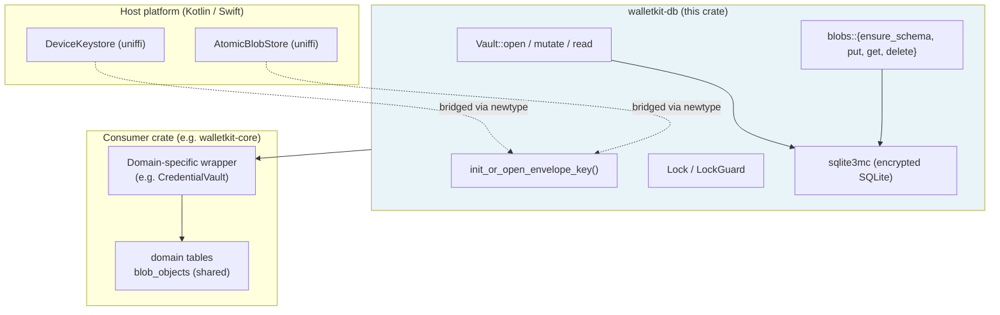

# walletkit-db

Encrypted on-device storage primitives for WalletKit. SQLCipher (`sqlite3mc`)
wrapper, vault opener, content-addressed blobs, sealed key envelope,
cross-process lock.

Consumed by `walletkit-core::storage` (credential vault) and by sibling
SDKs in the WalletKit workspace that need an encrypted on-device store.
Plain Rust, no `uniffi`.

## Concepts

There are five physical pieces. Knowing what each one is and isn't makes the
rest of the README straightforward.

- **Vault** — the encrypted SQLite database file on disk (e.g.
  `account.vault.sqlite`). Holds every row the consumer cares about,
  including the shared `blob_objects` table. Encrypted with sqlite3mc.
  Opened via `Vault::open`; mutated via `Vault::mutate` (which acquires
  the lock); read via `Vault::read` (which bypasses the lock).
- **Envelope** — a small CBOR-encoded file on disk (e.g.
  `account_keys.bin`) that holds the *sealed* 32-byte `K_intermediate`.
  Not a vault, not encrypted by sqlite3mc — it's the wrapper around the
  key that opens the vault. The seal is done by the host's hardware
  keystore. Managed by `init_or_open_envelope_key` + `KeyEnvelope`.
- **Lock** — a separate empty file (e.g. `account.lock`) used as a
  cross-process mutex via `flock` / `LockFileEx`. Not encrypted, not part
  of the vault. Prevents two processes (e.g. extension + main app) from
  racing on the open or mutate path. Owned by the `Vault` after `open`;
  `Vault::mutate` acquires it internally, so consumers never plumb a
  `LockGuard` through their method signatures.
- **blob_objects table** — one shared table inside the vault for
  content-addressed bytes. Consumer-specific tables (`credential_records`,
  `pcp_records`, etc.) reference rows here by `content_id` (SHA-256). Big
  payloads live here once, deduplicated by hash. Managed by `blobs::*`.
- **Keystore + AtomicBlobStore** — two traits the consumer (and
  ultimately the host platform) implements. `Keystore` seals/unseals
  bytes under `K_device`; `AtomicBlobStore` reads/writes the envelope
  file. walletkit-db never touches the OS keystore or the filesystem
  directly; it goes through these traits.

### How they interact at runtime

(For the open-and-initialize sequence, see [Startup sequence](#startup-sequence)
below.)

**Storing a payload:**

1. Inside `vault.mutate(|conn| { ... })`: `blobs::put(conn, kind, bytes,
   now)` hashes the bytes (`SHA-256("worldid:blob" || [kind] || bytes)`),
   `INSERT OR IGNORE`s into `blob_objects`, returns the `ContentId`.
2. The closure inserts the consumer's own row referencing that
   `content_id`, then commits its transaction.
3. The lock is held for the entire closure and released on return.

**Reading a payload:**

1. `vault.read()` returns `&Connection` directly — no lock acquisition.
2. The consumer queries its own table for the row + the `content_id`.
3. `blobs::get(vault.read(), &content_id)` returns the bytes from
   `blob_objects`.

**Deleting:**

1. Inside `vault.mutate(|conn| { ... })`: the consumer deletes from its
   own table.
2. If no other row references the same `content_id`, call
   `blobs::delete(conn, &content_id)` to GC the orphan from
   `blob_objects`. (walletkit-db doesn't track references; consumers
   decide when a blob has become unreferenced.)

The four files (vault, envelope, lock, and the consumer-chosen blob-store
backing) all live under paths the consumer picks. walletkit-db doesn't
prescribe where; it just expects them to stay together.

## Architecture



The dependency direction is one-way: `walletkit-db` doesn't know about its
consumers, uniffi, or any specific schema. Each consumer brings its own
filename, AD namespace, lock file, vault file, and SQL schema; the crate
gives them an encrypted database with the safety machinery wired up.

## Key hierarchy

- **`K_device`** — hardware keystore root key (iOS Secure Enclave / Android
  Keystore). Seal/unseal small blobs only; cannot be extracted from the
  device. Provided by the consumer via the `Keystore` trait.
- **`K_intermediate`** — 32-byte random key per consumer-vault. Generated
  once on first run with `getrandom`, sealed under `K_device`, persisted as
  a CBOR `KeyEnvelope`. Used as the SQLite page-encryption key by sqlite3mc.
- **AD (associated data)** — non-secret label bound into the AEAD seal
  (e.g. `worldid:account-key-envelope`). Per-consumer so envelopes can't be
  swapped between vaults; not a password.

Each consumer picks its own envelope filename + AD so independent vaults
never share intermediate keys, and so the host can apply different keystore
access policies (Face ID on one vault, none on another) per consumer.

## Startup sequence

**Cold start (first run, brand-new install):**

1. Open `Lock`, acquire `LockGuard`.
2. `init_or_open_envelope_key` calls `AtomicBlobStore.read(filename)` → `None`.
3. `getrandom::fill` → 32 random bytes = `K_intermediate`.
4. `K_device.seal(AD, K_intermediate)` → opaque ciphertext.
5. Wrap in `KeyEnvelope` (version, ciphertext, timestamps), CBOR-encode,
   `AtomicBlobStore.write_atomic` to disk.
6. `Vault::open` opens the SQLite file via `sqlite3_open_v2`.
7. `PRAGMA key = "x'<hex>'"` — sqlite3mc installs its encryption codec.
8. Schema callback: `blobs::ensure_schema(conn)` + consumer's schema DDL.
9. `PRAGMA integrity_check`.
10. Return open `Connection`.

**Warm start (every subsequent run):**

1. Open `Lock`, acquire `LockGuard`.
2. `AtomicBlobStore.read(filename)` → envelope bytes.
3. CBOR-decode, verify version, extract sealed ciphertext.
4. `K_device.open_sealed(AD, sealed_ciphertext)` → recover the **bit-for-bit
   original** `K_intermediate`. Encryption is reversible; nothing is
   re-derived.
5. `sqlite3_open_v2` + `PRAGMA key`. Wrong key returns `SQLITE_NOTADB` on
   the first page read.
6. Schema callback runs idempotently (`CREATE TABLE IF NOT EXISTS`).
7. Integrity check; return.

**Device wipe / app uninstall:** `K_device` is destroyed. The envelope on
disk becomes permanently unsealable. Recovery has to come from a separate
backup path that re-wraps `K_intermediate` (or the data) under a
non-device-bound key.

## Encryption mechanism (sqlite3mc)

After `PRAGMA key`, walletkit-db is out of the crypto loop. sqlite3mc takes
over inside SQLite's pager:

- **Cipher**: ChaCha20-Poly1305 AEAD. Default for sqlite3mc; no external
  crypto library.
- **KDF**: PBKDF2-SHA256 derives per-page subkeys from `K_intermediate` and
  the page number. Same plaintext on two pages does not produce identical
  ciphertext.
- **Pager hook**: every page read decrypts; every page write encrypts; SQL
  engine sees only plaintext.
- **What's encrypted**: every page in the file — tables, indexes, freelist,
  WAL. Only the first 16 bytes (`SQLite format 3\0` magic + header) stay
  plaintext so sqlite3mc can recognize the file before keying.
- **Tamper detection**: Poly1305 MAC per page. Bit-flip → `SQLITE_CORRUPT`.
  Wrong key → first decrypted page header is garbage → `SQLITE_NOTADB`.
- **Performance**: single-digit µs per 4KB page on modern ARM. This is why
  `K_intermediate` lives in main RAM — sqlite3mc invokes the codec
  hundreds of times per transaction and the secure enclave can't service
  that load.

## Threat model

| Tier | Status | What protects you |
|------|--------|-------------------|
| Disk copy / lost device / unencrypted backup | **Safe** | Vault + envelope are encrypted; attacker lacks `K_device`. |
| Code running inside the app session | **Exposed** | Attacker calls the legitimate keystore as the app and unseals envelopes. Separate `K_intermediate` per consumer does not change this. |
| File corruption / envelope swap between vaults | **Safe** | Per-page MAC fails on corrupted pages; AD binding fails AEAD auth on swapped envelopes. |
| Hardware keystore compromise | Out of scope | — |

**Defense-in-depth lever** against in-app attackers: host policy on the
keystore entry (iOS `kSecAccessControlBiometryCurrentSet`, Android
`setUserAuthenticationRequired(true)`, etc.). walletkit-db is neutral; the
policy lives in the Kotlin/Swift code that creates `K_device`.

**Why per-consumer `K_intermediate` exists** (not for in-app isolation):

1. sqlite3mc needs a key in main RAM anyway — the enclave doesn't expose
   bulk encryption, so we cannot use `K_device` directly.
2. **Per-keystore-entry policy.** Host can require Face ID on one vault's
   unseal but not another — only possible with separate envelopes.
3. Independent rotation, recovery, and file lifecycle per consumer.
4. AEAD tamper-evidence on each envelope.

## Intended usage

A new consumer wires up storage in four steps. Each consumer picks its own
paths, envelope filename, associated-data namespace, and SQL schema:

```rust
use walletkit_db::{blobs, init_or_open_envelope_key, Lock, Vault};

// 1. Cross-process lock. One file per consumer.
let lock = Lock::open(&paths.lock_path())?;

// 2. Unseal or generate the consumer's intermediate key.
//    Filename + AD are per-consumer so different vaults never share keys.
//    Acquires `lock` internally, releases on return.
let k_intermediate = init_or_open_envelope_key(
    &my_keystore_adapter,
    &my_blob_store_adapter,
    &lock,
    "my_consumer_keys.bin",
    b"my-consumer:key-envelope",
    now,
)?;

// 3. Open the encrypted SQLite database with the consumer's own schema.
//    Vault takes ownership of `lock` and re-acquires it for each mutation.
let vault = Vault::open(&paths.db_path(), &k_intermediate, lock, |conn| {
    blobs::ensure_schema(conn)?;      // shared blob_objects table
    my_schema::ensure_schema(conn)    // consumer's own tables
})?;

// 4. Mutations run under a freshly-acquired lock.
let cid = vault.mutate(|conn| {
    blobs::put(conn, MY_KIND_TAG, &payload_bytes, now)
})?;

// Reads bypass the lock (SQLite WAL handles concurrent readers).
let bytes = blobs::get(vault.read(), &cid)?.expect("present");

// Deletes are mutations.
vault.mutate(|conn| blobs::delete(conn, &cid))?;
```

The consumer brings:

- A type implementing `Keystore` (seal/open under a device-bound key)
- A type implementing `AtomicBlobStore` (small-blob persistence — e.g. the
  sealed envelope file)
- A `kind: u8` tag space for blob payloads
- Its own SQL schema and queries

The crate handles cipher setup, schema dispatch, integrity check, content
hashing (`SHA-256(b"worldid:blob" || [kind] || plaintext)`), CBOR-encoded
envelope persistence, and the lock.

## Public surface

- `Vault::open(path, key, lock, ensure_schema) -> StoreResult<Vault>` —
  open + key + schema + integrity check.
- `Vault::read(&self) -> &Connection` — read-only access, no lock.
- `Vault::mutate(&self, f) -> Result<R, E>` — runs `f` under a
  freshly-acquired lock; `E: From<StoreError>`.
- `blobs::{ensure_schema, put, get, delete, compute_content_id}` plus
  `pub type ContentId = [u8; 32]`.
- `init_or_open_envelope_key(...) -> StoreResult<SecretBox<[u8; 32]>>`.
- `Lock` — native `flock` / `LockFileEx`, no-op on WASM.
- `Keystore` / `AtomicBlobStore` traits — plain Rust. Consumers that expose
  FFI define their own annotated traits and bridge with a small newtype.
- `Connection`, `Transaction`, `Statement`, `Row`, `StepResult`, `Value`,
  `cipher::*`, `DbError`, `DbResult`, `StoreError`, `StoreResult` — the
  underlying SQLite wrapper and error types.

## On-disk format

Schemas, CBOR envelope layout, content_id derivation, and the
`account_keys.bin` / `worldid:account-key-envelope` filename + AD tags are
byte-stable. Existing user databases keep working without migration.
Frozen-byte tests in `src/tests.rs` guard the format.

## Platforms

- Native (macOS, Linux, Windows): static `sqlite3mc` from the build script.
- `wasm32-unknown-unknown`: `sqlite-wasm-rs` with the `sqlite3mc` feature;
  `Lock` collapses to a no-op (single-threaded Web Worker runtime).
