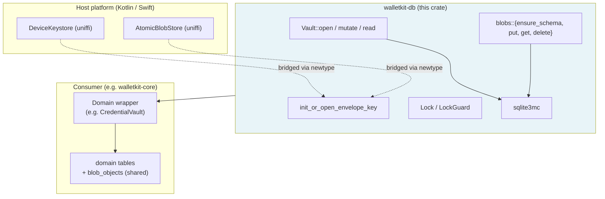

# walletkit-db

Encrypted on-device storage primitives for WalletKit. SQLCipher (`sqlite3mc`) wrapper, vault opener, content-addressed blobs, sealed key envelope, cross-process lock. Plain Rust, no `uniffi`.

Consumed by `walletkit-core::storage` (credential vault) and by sibling SDKs in the WalletKit workspace that need an encrypted on-device store.

## Concepts

Five physical pieces. Knowing what each one is and isn't makes everything else straightforward.

- **Vault** — the encrypted SQLite file on disk (e.g. `account.vault.sqlite`). Opened by `Vault::open`; mutated via `Vault::mutate` (which holds the lock for the closure); read via `Vault::read` (which bypasses it).
- **Envelope** — a small CBOR file (e.g. `account_keys.bin`) holding the sealed 32-byte `K_intermediate`. The seal is done by the host's hardware keystore. Managed by `init_or_open_envelope_key` + `KeyEnvelope`.
- **Lock** — a separate empty file used as a cross-process mutex via `flock` / `LockFileEx`. Owned by the `Vault` after open; consumers never plumb a `LockGuard` through their method signatures.
- **`blob_objects` table** — one shared table inside the vault for content-addressed bytes, keyed by SHA-256. Consumer-specific tables reference rows here by `content_id`. Managed by `blobs::*`.
- **`Keystore` + `AtomicBlobStore`** — two traits the host implements. `Keystore` seals/unseals bytes under `K_device`; `AtomicBlobStore` reads/writes the envelope file. walletkit-db never touches the OS keystore or the filesystem directly.

## Architecture



Dependency direction is one-way: walletkit-db doesn't know about its consumers, uniffi, or any specific schema. Each consumer brings its own filename, AD namespace, lock file, vault file, and SQL schema.

## Key hierarchy

- **`K_device`** — hardware keystore root key (iOS Secure Enclave / Android Keystore). Cannot be extracted; the chip seals and unseals bytes on the program's behalf. Provided by the host via the `Keystore` trait.
- **`K_intermediate`** — 32-byte random key per consumer-vault. Generated once via `getrandom`, sealed under `K_device`, persisted as a CBOR `KeyEnvelope`. Used as the SQLite page-encryption key by sqlite3mc.
- **AD** — non-secret label bound into the AEAD seal (e.g. `worldid:account-key-envelope`). Per-consumer so envelopes can't be swapped between vaults.

## Startup

**Cold start:** open `Lock` → `init_or_open_envelope_key` generates fresh `K_intermediate`, seals it via `Keystore`, writes the envelope via `AtomicBlobStore`. `Vault::open` opens the SQLite file via `sqlite3mc`, runs the consumer's schema callback, runs `PRAGMA integrity_check`.

**Warm start:** same flow, but the envelope already exists. `init_or_open_envelope_key` reads and unseals it to recover the bit-for-bit original `K_intermediate`. Schema callback is idempotent (`CREATE TABLE IF NOT EXISTS`).

**Device wipe / app uninstall:** `K_device` is destroyed. The envelope on disk becomes permanently unsealable. Recovery requires a separate backup path that re-wraps the data under a non-device-bound key.

## Encryption

After `PRAGMA key`, sqlite3mc takes over inside SQLite's pager. ChaCha20-Poly1305 AEAD per page; per-page subkeys derived via PBKDF2-SHA256 from `(K_intermediate, page_number)`. Tamper-detected via Poly1305 MAC. Wrong key → `SQLITE_NOTADB` on first page read. Bit-flip on disk → `SQLITE_CORRUPT`. WAL mode for concurrent readers.

## Threat model

| Tier | Status | What protects you |
|---|---|---|
| Disk copy / lost device / backup extraction | **Safe** | Vault + envelope are encrypted; attacker lacks `K_device`. |
| Code running inside the app session | **Exposed** | Attacker calls the legitimate keystore as the app and unseals envelopes. Defense lives at the keystore-entry access policy layer. |
| File corruption / envelope swap | **Safe** | Per-page MAC fails; AD binding fails AEAD auth on swapped envelopes. |
| Hardware keystore compromise | Out of scope | — |

**Defense-in-depth lever:** host policy on the keystore entry (iOS `kSecAccessControlBiometryCurrentSet`, Android `setUserAuthenticationRequired(true)`). walletkit-db is neutral; the policy lives in the Kotlin/Swift code that creates `K_device`.

## Host-side contract for multi-consumer isolation

When multiple consumers share the device (credential vault, future PCP store, future NFC issuer, etc.), trust isolation between them depends on the **host** wiring each consumer to its own resources. walletkit-db cryptographically enforces only the AD binding; the rest is host discipline.

**Hosts MUST, per consumer:**

1. **A distinct hardware keystore entry.** Each consumer's `Keystore` impl must point at a separate Secure Enclave key / Android Keystore alias. Sharing one entry across consumers means a compromised consumer can ask the OS to unseal another's envelope.
2. **A distinct AD** passed to `init_or_open_envelope_key`. AD binding makes envelopes non-fungible — sealed under one AD, will not open under another.
3. **A distinct envelope filename, vault file, and lock file.** No shared paths.

**What walletkit-db enforces vs what it can't:**

| Guarantee | Enforced by |
|---|---|
| Envelope sealed under AD `X` won't open under AD `Y` | walletkit-db (AEAD on `Keystore::open_sealed`) |
| Opening vault `A` with vault `B`'s `K_intermediate` fails | walletkit-db + sqlite3mc (`SQLITE_NOTADB`) |
| Consumer `A` cannot ask the keystore for consumer `B`'s `K_device` | **Host.** Requires distinct keystore entries with distinct identities. |
| Consumer `A` cannot read consumer `B`'s envelope from disk | **Host.** Requires per-consumer file paths inside the app sandbox. |

A future IssuerKit layer is the long-term home for enforcing one-keystore-entry-per-issuer in code. Until then this contract lives in the host integration.

## Usage

A consumer wires up storage in four steps:

```rust
use walletkit_db::{blobs, init_or_open_envelope_key, Lock, Vault};

// 1. Cross-process lock. One file per consumer.
let lock = Lock::open(&paths.lock_path())?;

// 2. Unseal or generate the consumer's intermediate key.
//    Filename + AD are per-consumer so different vaults never share keys.
let k_intermediate = init_or_open_envelope_key(
    &my_keystore_adapter,
    &my_blob_store_adapter,
    &lock,
    "my_consumer_keys.bin",
    b"my-consumer:key-envelope",
    now,
)?;

// 3. Open the encrypted SQLite database with the consumer's own schema.
let vault = Vault::open(&paths.db_path(), &k_intermediate, lock, |conn| {
    blobs::ensure_schema(conn)?;
    my_schema::ensure_schema(conn)
})?;

// 4. Store / read / delete.
let cid = vault.mutate(|conn| {
    blobs::put(conn, MY_KIND_TAG, &payload_bytes, now)
})?;
let bytes = blobs::get(vault.read(), &cid)?.expect("present");
vault.mutate(|conn| blobs::delete(conn, &cid))?;
```

The consumer brings a `Keystore` impl, an `AtomicBlobStore` impl, a `kind: u8` tag space, and its own SQL schema. The crate handles cipher setup, schema dispatch, integrity check, content hashing (`SHA-256("worldid:blob" || [kind] || plaintext)`), CBOR envelope persistence, and the lock.

## Public surface

- `Vault::open(path, key, lock, ensure_schema) -> StoreResult<Vault>`, `Vault::read(&self) -> &Connection`, `Vault::mutate(&self, f) -> Result<R, E>`.
- `blobs::{ensure_schema, put, get, delete, compute_content_id}` plus `pub type ContentId = [u8; 32]`.
- `init_or_open_envelope_key(...) -> StoreResult<SecretBox<[u8; 32]>>`.
- `Lock` / `LockGuard` — native `flock` / `LockFileEx`, no-op on WASM.
- `Keystore` / `AtomicBlobStore` traits — plain Rust.
- `Connection`, `Transaction`, `Statement`, `Row`, `StepResult`, `Value`, `cipher::*`, `DbError`, `DbResult`, `StoreError`, `StoreResult`.

## On-disk format

Schemas, CBOR envelope layout, content_id derivation, and the `account_keys.bin` / `worldid:account-key-envelope` filename + AD tags are byte-stable. Existing user databases keep working without migration. Frozen-byte tests in `src/tests.rs` guard the format.

## Platforms

Native (macOS, Linux, Windows): static `sqlite3mc` from the build script. `wasm32-unknown-unknown`: `sqlite-wasm-rs` with the `sqlite3mc` feature; `Lock` collapses to a no-op.
